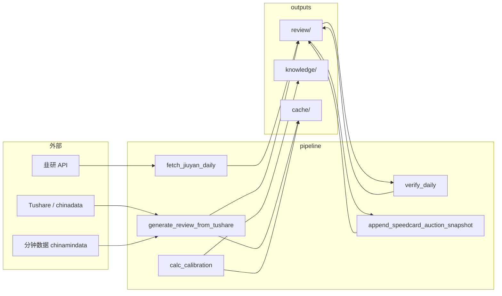

# 云服务器 → 本地 `self-learning` 迁移说明（role1-stock）

本文档描述 **`outputs/` 复盘产出**、**`pipeline/` 脚本** 与 **`盘中监控脚本/`（Node + 速查监控 Python）** 在工作区内的位置、依赖闭包、验证方式与与服务器对齐的注意事项。

---

## 1. 迁移后的目录结构

工作区根目录下的 **`self-learning`** 为独立 Git 仓库（可推 GitHub）。

```
self-learning/
├── README.md
├── .gitignore
└── role1-stock/
    ├── MIGRATION.md          # 本文件
    ├── requirements.txt      # Python 依赖清单
    ├── pipeline/             # 可执行脚本（与 outputs 同级，见 _paths.py）
    │   ├── _paths.py         # 唯一「工程根」解析：parent(pipeline) / outputs
    │   ├── generate_review_from_tushare.py
    │   ├── fetch_jiuyan_daily.py
    │   ├── verify_daily.py
    │   ├── calc_calibration.py
    │   ├── append_speedcard_auction_snapshot.py
    │   ├── realtime_engine.py / realtime_monitor_report.py / …
    │   └── …
    ├── 盘中监控脚本/         # 三 Tab 仪表盘（Node）+ speedcard_monitor.py（读 ../outputs、../pipeline）
    │   ├── server.js
    │   ├── package.json
    │   ├── speedcard_monitor.py / speedcard_data.py
    │   └── public/
    └── outputs/              # 运行产出与知识库（主入口）
        ├── review/           # 每日复盘表、速查、执行手册、韭研 md/json 等
        ├── knowledge/        # 经验库.md、情绪日历.csv 等
        ├── cache/            # 校准缓存、dashboard、API 缓存目录等
        └── logs/             # 监控/定时任务日志（通常不入库，见 .gitignore）
```

**不变量（路径）**：`pipeline/_paths.py` 将「工程根」定为 **`pipeline` 的父目录**（即 `role1-stock/`），其下 **`outputs/`** 为唯一产出根。  
因此 **`role1-stock/pipeline`、`role1-stock/outputs`、`role1-stock/盘中监控脚本` 必须相对于同一「工程根」`role1-stock/` 布置**（与原先 `jumpingnow_all/` 下三者同级关系一致）；不要求本机存在 `jumpingnow_all`。

---

## 2. 依赖关系（简图与列表）

### 2.1 数据流简图



**盘中仪表盘**：`盘中监控脚本/server.js` 读取同级父目录下的 `outputs/cache/dashboard_latest.json`、`outputs/review/*.md`（路径为 `path.join(__dirname, '..', 'outputs', …)`）。`speedcard_monitor.py` 通过 `sys.path` 引用 **`../pipeline`** 的 `realtime_engine`、`_paths`。

### 2.2 主要可执行入口（`if __name__ == "__main__"`）

| 脚本 | 作用摘要 | 主要读/写 |
|------|-----------|-----------|
| `fetch_jiuyan_daily.py` | 拉取韭研异动 | 写 `outputs/review/韭研异动_*.md`、`.json` |
| `generate_review_from_tushare.py` | 生成每日复盘表等 | 读 API/缓存；读 `review/韭研异动_*.json`；写 `review/`、`cache/.review_api_cache/` 等 |
| `verify_daily.py` | 速查验证报告 | 读 `review/`；写验证报告 md |
| `calc_calibration.py` | 竞价阈值校准 | 读 API；写 `cache/calibration_cache.json` 等 |
| `append_speedcard_auction_snapshot.py` | 速查附录竞价快照 | 读/写指定速查 md |
| `backfill_experience.py` | 经验库回溯 | 读 `review/`；写 `knowledge/经验库.md` |
| `realtime_engine.py` / `realtime_monitor_report.py` | 盘中/监控 | 读 `review/` 速查等；写 `logs/` 等 |
| `盘中监控脚本/speedcard_monitor.py` | 早盘速查监控（9:15～9:50） | 读 `../pipeline`；读/写 `outputs/review/`、`outputs/cache/`、`outputs/logs/` |
| `盘中监控脚本/server.js`（`npm start`） | 三 Tab 仪表盘 HTTP | 读 `outputs/cache/*.json`、`outputs/review/*.md` |
| 其余 `test_*.py`、`*_monitor*.py` | 测试或辅助 | 见各文件 docstring |

**Import 约定**：业务脚本统一 `from _paths import …`，**不**依赖 `PYTHONPATH` 指向仓库外；运行时应 **`cd` 到 `pipeline` 目录** 或保证 `pipeline` 在 `sys.path[0]`（与在云服务器上「在 pipeline 目录执行」一致）。

**子进程**：当前核心复盘链路以 Python 为主；`fetch_jiuyan` 已改为 HTTP API，**不依赖** Node 执行 `_nuxt_eval.cjs`（该文件保留兼容旧流程，且已改为相对 `__dirname` 读 `_nuxt_expr.js`）。`realtime_engine` 部分路径可选 **Playwright Chromium**（见该文件说明）。

### 2.3 `outputs/` 内「非脚本」文件

| 类型 | 说明 |
|------|------|
| `review/*.md`、`*.json` | 生成物与人工阅读入口；**不**被 Python import |
| `knowledge/经验库.md` 等 | 长期知识资产；由 Step2/回溯脚本等追加 |
| `cache/*` | 校准结果、dashboard JSON、API 缓存等；**大体积 pkl 缓存见 .gitignore** |

---

## 3. 最小闭包（已迁入内容）

为在 **`self-learning/role1-stock`** 内完整运行「复盘 pipeline + 可选盯盘网站」所需：

- **已纳入**：`pipeline/` 全部脚本、`outputs/` 下业务目录（`review`、`knowledge`、`cache` 中必要部分）、**`盘中监控脚本/`**（`npm install` 生成 `node_modules/`，**不入库**，见 `.gitignore`）。
- **不纳入仓库（建议）**：`outputs/cache/.review_api_cache/`、`.review_profile/` 等大体积可重建缓存（见 `.gitignore`）。
- **仅跑 Python 复盘、不需要浏览器仪表盘时**：可不启动 `盘中监控脚本`；但目录已与 `pipeline`/`outputs` 一并迁入，路径与服务器一致。

---

## 4. 密钥、Token 与推送 GitHub 前检查

多处脚本内含 **Tushare / 韭研 Cookie·Token** 等硬编码字符串（与服务器一致时可运行，但**不适合公开仓库**）。

**推送前建议**：

1. 在 GitHub 使用 **Private** 仓库，或  
2. 将敏感信息改为环境变量/本地未跟踪文件，并对历史做一次清理（如 `git filter-repo`），或轮换服务器与本地已暴露的 Token。

本仓库 `.gitignore` 已包含 `.env`；**尚未**将脚本全部改为读 `.env`，需与代码改造配合。

---

## 5. 本地验证命令与通过标准

以下命令在 **`self-learning/role1-stock/pipeline`** 下执行（路径按你本机克隆位置调整）。

### 5.1 路径与导入（无网络）

```bash
cd /path/to/self-learning/role1-stock/pipeline
python3 -c "from _paths import OUTPUTS, REVIEW_DIR; assert REVIEW_DIR.parent == OUTPUTS; print('OUTPUTS=', OUTPUTS); print('OK')"
```

**通过标准**：打印 `OUTPUTS=` 为 `…/role1-stock/outputs`，无 `AssertionError`。

### 5.2 依赖是否齐全（无 API 调用）

```bash
python3 -c "import pandas, requests; import chinadata.ca_data as ts; import chinamindata.min as tss; print('imports OK')"
```

**通过标准**：无 `ModuleNotFoundError`。若缺 `chinadata`/`chinamindata`，按 `requirements.txt` 与服务器安装方式对齐。

### 5.3 单日复盘生成（需有效 Token 与网络；与服务器对齐）

示例（交易日 `YYYYMMDD` 自行替换）：

```bash
cd /path/to/self-learning/role1-stock/pipeline
python3 fetch_jiuyan_daily.py --date 2026-04-20
python3 generate_review_from_tushare.py --trade-date 20260420
python3 verify_daily.py --date 20260420
```

**通过标准**：

- 退出码为 `0`；
- `outputs/review/` 下对应日期的 `每日复盘表_*`、`验证报告_*` 等生成或更新；
- **与服务器对比**：同一 `--trade-date`、同一依赖版本、同一缓存策略（如均使用 `--no-cache` 或均使用相同缓存目录）下，生成 md **核心表格与数值**应一致；若 API 返回随时间变化，仅对比「脚本逻辑」一致，并接受行情数据差异。

### 5.4 校准（可选）

```bash
python3 calc_calibration.py --end-date 20260420 --trade-days 30
```

**通过标准**：退出码 `0`，`outputs/cache/calibration_cache.json`（及相关缓存目录）按脚本设计更新。

### 5.5 盘中监控仪表盘（Node + 可选 Python）

**前提**：`role1-stock/盘中监控脚本` 下已执行 `npm install`（首次克隆后必做）。

```bash
cd /path/to/self-learning/role1-stock/盘中监控脚本
npm start
```

**通过标准**：进程启动后控制台打印 `访问：http://localhost:3456`；浏览器打开该地址可加载静态页；`/api/data` 在存在 `outputs/cache/dashboard_latest.json` 时返回 JSON，否则返回 503（与服务器行为一致）。

**竞价 Tab 实时刷新（与服务器一致）**：另开终端，在同一 `role1-stock` 布局下：

```bash
cd /path/to/self-learning/role1-stock/盘中监控脚本
python3 speedcard_monitor.py --once   # 或交易日 9:15～9:50 使用无 --once
```

**通过标准**：向 `outputs/cache/dashboard_latest.json`（及按日 `dashboard_YYYYMMDD.json`）写入；`server.js` 的 SSE `/api/stream` 可推送更新。

---

## 6. 与云服务器无法 100% 对齐的差异清单

| 差异 | 原因 | 缓解措施 |
|------|------|----------|
| API 返回数据不同 | 行情/韭研为实时数据，不同时间拉取不一致 | 固定同一 `--trade-date`；对比时用同一天闭市后快照；或使用同一 `cache` 目录复制 |
| 数值浮点/列顺序 | pandas 版本差异 | `requirements.txt` 与服务器对齐；记录 `pip freeze` |
| 分钟/竞价接口 | `chinamindata` 或权限与服务器不同 | 使用同一 token；检查服务器 `pip freeze` |
| Playwright 路径 | 本机未装 Chromium | 仅跑复盘表可不装；跑 `realtime_engine` 部分功能时 `playwright install chromium` |
| 日志与缓存未提交 | `.gitignore` 忽略大缓存与 `*.log` | 运行后本地重新生成；或大文件用网盘单独同步 |
| Node/npm 版本差异 | 与服务器 `node -v` / `npm -v` 不同 | 以 `package-lock.json` 为准执行 `npm ci` 或 `npm install` |

---

## 7. Git 与一次性提交建议

- 在 **`self-learning` 根** 执行 `git add role1-stock/`、`git status` 确认无意外纳入 `*.pkl` 大缓存。
- 若误加入大文件：`git rm --cached` 并补全 `.gitignore` 规则。

---

## 8. 维护说明

- **路径锚点**：`role1-stock/pipeline/_paths.py`（Python 产出根）；`盘中监控脚本/server.js` 以 **`__dirname/../outputs`** 定位数据。若未来移动 `role1-stock`，保持 **`pipeline`、`outputs`、`盘中监控脚本` 三者为同一父目录下的同级目录** 即可，无需改脚本。
- 从 **`jumpingnow_all`** 同步更新时，可对 `pipeline/`、`outputs/`、**`盘中监控脚本/`** 分别使用 `rsync`（注意勿覆盖本地 `.env` 与私有缓存策略；`node_modules/` 勿提交，由本地 `npm install` 重建）。
